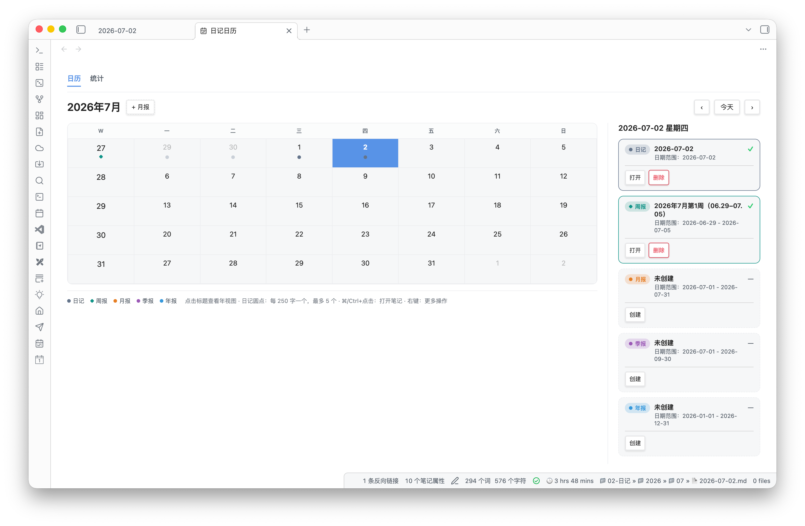
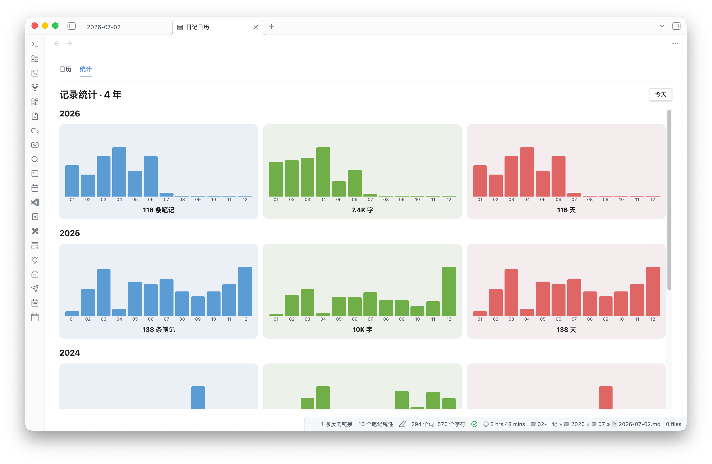

# 安装指南

仓库地址：[github.com/KazooTTT/periodic-calendar-page](https://github.com/KazooTTT/periodic-calendar-page)

## 前置依赖

1. 安装并启用 [Periodic Notes](https://github.com/liamcain/obsidian-periodic-notes)
2. Obsidian 版本 ≥ 1.5.0
3. 在 Periodic Notes 中配置好日记 / 周报 / 月报 / 季报 / 年报的文件夹与格式

## 方式一：BRAT（推荐）

适合想跟踪 `main` 分支最新版的用户。

1. 安装社区插件 [BRAT](https://github.com/TfTHacker/obsidian42-brat)
2. 打开 BRAT 设置 → **Add Beta plugin**
3. 填入仓库：

   ```
   KazooTTT/periodic-calendar-page
   ```

4. 选择跟踪分支 `main`（或指定 release tag）
5. 在 Obsidian **设置 → 第三方插件** 中启用 **Periodic Calendar Page**

> BRAT 会从仓库根目录读取 `manifest.json`、`main.js`、`styles.css`，请确认仓库已包含构建好的 `main.js`。

## 方式二：手动安装

1. 打开 [Releases](https://github.com/KazooTTT/periodic-calendar-page/releases)（或克隆仓库）
2. 将以下三个文件放入 vault：

   ```
   <你的库>/.obsidian/plugins/periodic-calendar-page/
   ├── manifest.json
   ├── main.js
   └── styles.css
   ```

3. 重启 Obsidian 或重载插件
4. 在 **设置 → 第三方插件** 中启用 **Periodic Calendar Page**

### 从源码构建后手动安装

```bash
git clone https://github.com/KazooTTT/periodic-calendar-page.git
cd periodic-calendar-page
npm install
npm run build
```

构建完成后，`main.js`、`manifest.json`、`styles.css` 会生成在仓库根目录，再复制到 `.obsidian/plugins/periodic-calendar-page/` 即可。

本地开发若需同步到另一个 vault，可使用：

```bash
VAULT_PLUGIN_DIR=/path/to/vault/.obsidian/plugins/periodic-calendar-page npm run build:vault
```

## 方式三：Obsidian 官方社区插件市场（尚未上架）

目前**尚未**提交到 [obsidian-releases](https://github.com/obsidianmd/obsidian-releases) 社区列表。上架前请查看 [PUBLISH_CHECKLIST.md](./PUBLISH_CHECKLIST.md)。

上架后可在 Obsidian 内置插件市场搜索 **Periodic Calendar Page** 直接安装。

## 验证安装

1. 命令面板（⌘/Ctrl+P）搜索 **打开日记日历**，应打开全屏日历页
2. 命令面板搜索 **打开记录统计**，应进入统计视图
3. 左侧 Ribbon 应出现 `calendar-range` 图标

## 常见问题

| 问题 | 处理 |
|------|------|
| 日历为空 / 无标记 | 检查 Periodic Notes 是否启用，文件夹配置是否正确 |
| 周期笔记无法识别 / 日历无标记 | ① 确认 Periodic Notes 文件夹配置正确；② 检查 frontmatter 是否有 `date` 和 `slug`（最稳妥）；③ 插件内置四级回落（format → 备用文件名 → 中文标题正则 → frontmatter） |
| 统计只有部分年份 | 统计仅计入**有日记文件**的年份 |
| BRAT 安装后无法启用 | 确认仓库根目录存在 `main.js`（需 release 或 main 分支已提交构建产物） |

## 截图





在 GitHub README 中查看：[README.md](../README.md)